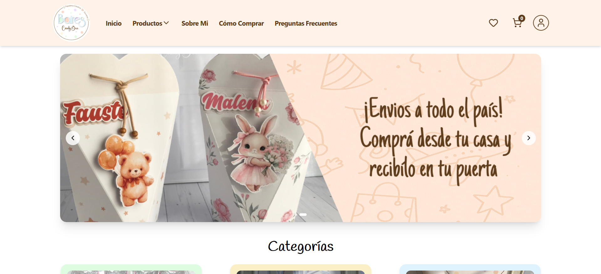
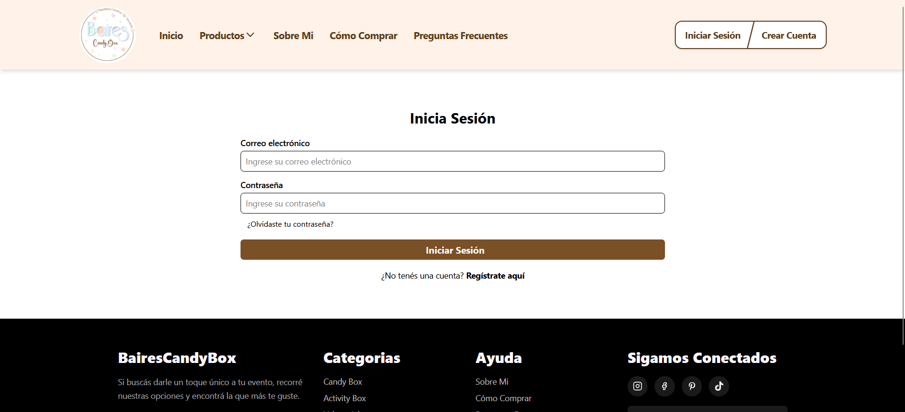
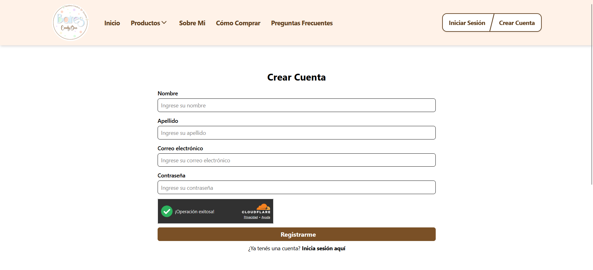
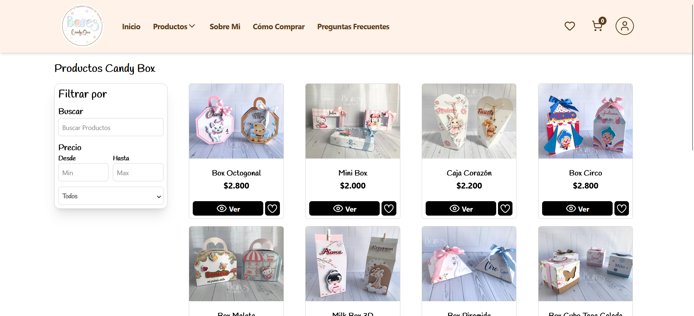
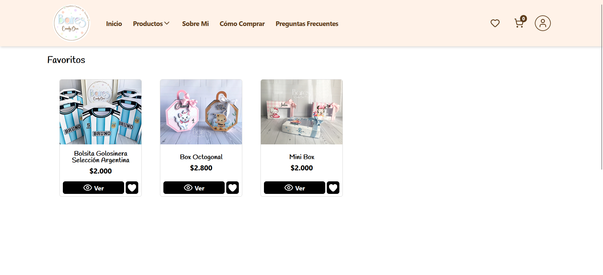
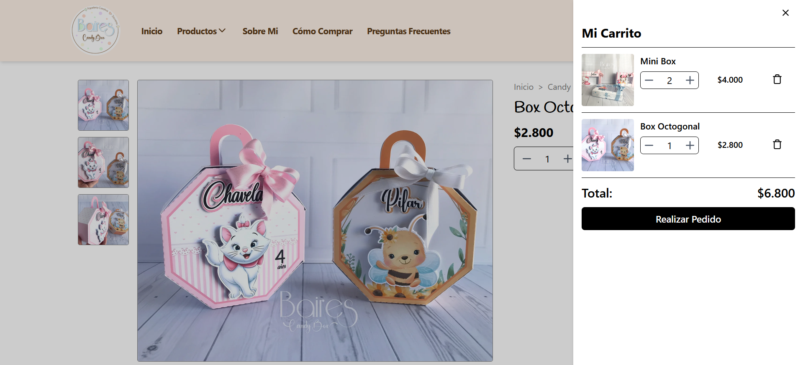
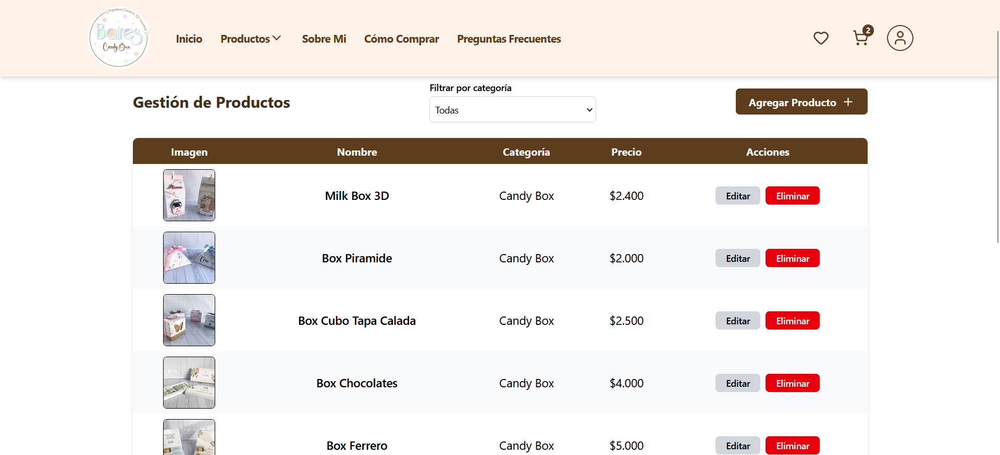

# Ecommerce "BairesCandyBox"

Aplicación web full‑stack orientada a la venta de productos personalizados para eventos.

## 🚀 Descripción
BairesCandyBox es una plataforma de ecommerce que permite a los usuarios registrarse, verificar sus cuentas por correo electrónico y gestionar productos personalizados para eventos. Incluye funcionalidades de carrito de compras, favoritos, ofreciendo una experiencia de usuario completa y fluida.

## 🛠️ Tecnologías utilizadas
- **Frontend:** React, TailwindCSS
- **Backend:** Node.js, Express
- **Base de datos:** PostgreSQL
- **Autenticación y verificación:** Nodemailer + Gmail SMTP
- **Herramientas:** Git/GitHub, VSCode

## ✨ Funcionalidades principales
- Roles (Usuario/Administrador)
- Registro y verificación de cuentas vía email.
- Gestión de productos y consultas de clientes.
- Carrito de compras y sistema de favoritos.
- Interfaz responsiva y moderna.

## 🌐 Sitio
Accedé a la web en: [https://bairescandybox.com.ar](https://bairescandybox.com.ar)

## 📸 Capturas

### Página principal

### Login

### Register

### Lista de Productos

### Favoritos

### Carrito de compras

### Admin Productos

## 📄 Nota
Este repositorio es una versión pública con fines demostrativos.  
El código fuente completo se encuentra en un repositorio privado.
